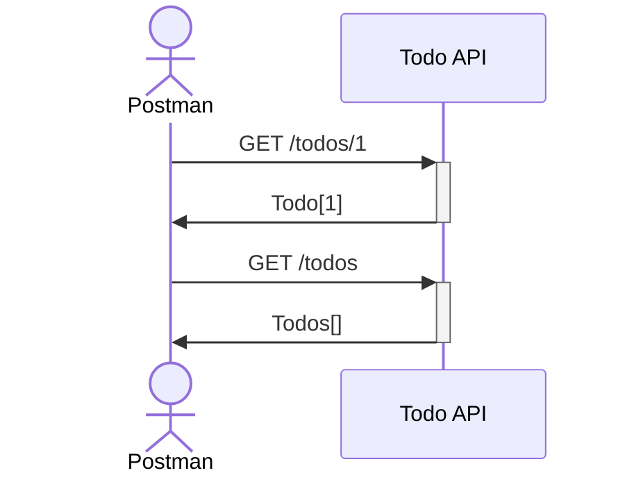
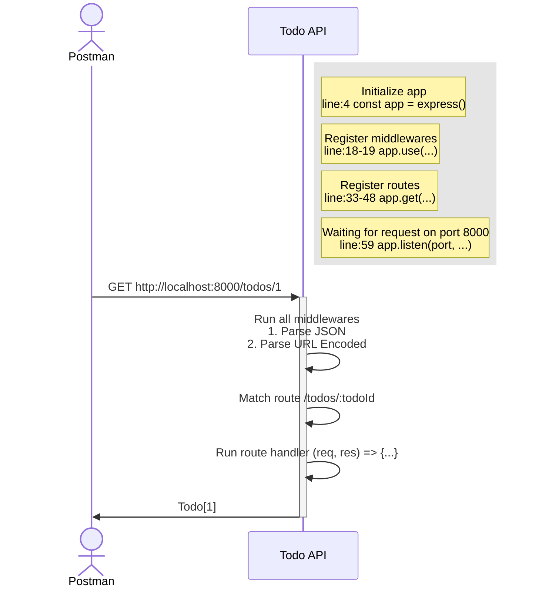

# Todo API: Read

## Overview

In this exercise, we will initialize a Postman collection and test an already existing get and list API.



## Recap

Dive into the Express app, app.js and see how it works.




### Middlewares

Middlewares are functions that run before the route handler. They are used to perform common tasks such as parsing the request body, validating the request, etc.

#### Parse JSON

```js
app.use(express.json());
```

This middleware parses the request body and populates the `req.body` property with the parsed JSON object. Only requests with `Content-Type: application/json` header will be parsed.

#### Parse URL Encoded

```js
app.use(express.urlencoded({ extended: true }));
```

This middleware parses the request body and populates the `req.body` property with the parsed URL encoded object. Only requests with `Content-Type: application/x-www-form-urlencoded` header will be parsed.
