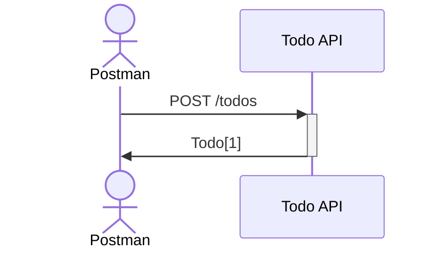

# Todo API: Create

## Overview

In this exercise, we will create a new todo using Postman.

## Challenge

Prevent the client from creating a todo with an empty title and description.

## Data Model

In this exercise, we will use the following data model located in `05-99-model/todo.mjs`.

The Todo model acts as an API to the database. It provides methods to create, read, update and delete todos.

## ECMAScript module (mjs)

The `mjs` extension is used to denote a JavaScript module. It is a new feature introduced in Node.js 12. It allows us to use the `import` and `export` syntax.
