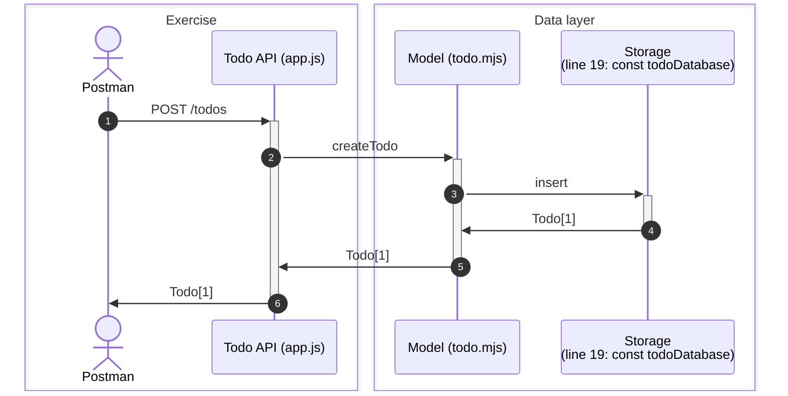

# Todo API: Create

## Overview

In this exercise, we will create a new todo using Postman.



## Challenge

Prevent the client from creating a todo with an empty title and description.

## Miscellaneous

### Model

In this exercise, we will use the following data model located in `05-99-model/todo.mjs`.

The Todo model acts as an API to the database. It provides methods to create, read, update and delete todos.

### Error

An error is an object that contains information about an error that occurred during the execution of the program. It contains a message and a stack trace.

```js
const error = new Error('Error message');
```

### Throw

Throwing an error is one way to stop the execution and cause the application to crash. As to why we would want to do that, it is because we want to prevent the application from continuing to run in an invalid state.

To throw an error, use the `throw` keyword followed by an error object.

```js
throw new Error('Error message');
```

### ECMAScript module (mjs)

The `mjs` extension is used to denote a JavaScript module. It is a new feature introduced in Node.js 12. It allows us to use the `import` and `export` syntax.
