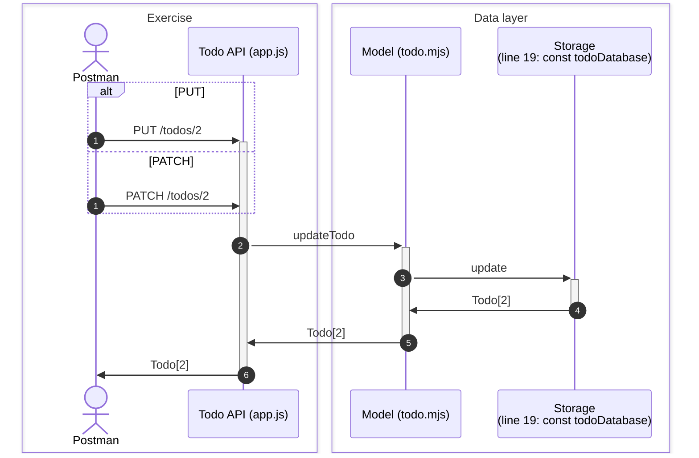
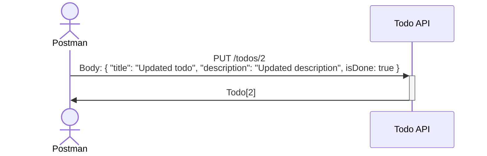
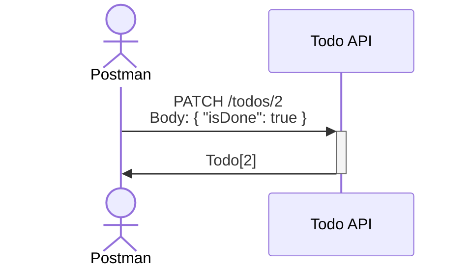

# Todo API: Update!

## Overview

Understand different ways to update a todo.



## Challenge

### Validate required properties

Make sure that PUT body contains all the properties of the todo. No more, no less.

eg. PUT /todos/2

```json
{
  "title": "Updated todo",
  "description": "Updated description",
  "isDone": true
}
```

Should update the todo with id 2 to the following:

```json
{
  "id": 2,
  "title": "Updated todo",
  "description": "Updated description",
  "isDone": true
}
```

But PUT /todos/2

```json
{
  "isDone": true
}
```

Should fail with 400 Bad Request stating that the title and description are required.

### White-list properties

Make sure that in PATCH handler, only the properties that are allowed to be updated are updated.

eg. PATCH /todos/2

```json
{
  "title": "Updated todo",
  "description": "Updated description",
  "isDone": true,
  "id": 3,
  "createdAt": "2021-01-01T00:00:00.000Z"
}
```

Should update the todo with id 2 to the following:

```json
{
  "id": 2,
  "title": "Updated todo",
  "description": "Updated description",
  "isDone": true
}
```

There should be no extra properties in the updated todo.

## Miscellaneous

### Different between PUT and PATCH

The PUT method replaces the entire resource with the new one. The PATCH method replaces only the specified properties of the resource.

#### PUT

Update the entire resource. Used when the client has the entire resource and wants to replace the existing resource with the new one.



#### PATCH

Update only the specified properties of the resource. Used when the client has only the properties that need to be updated.


