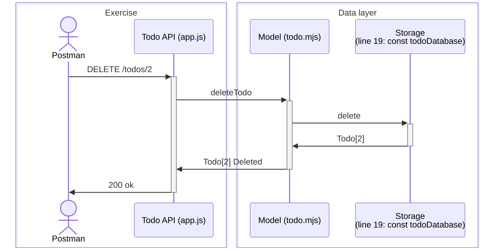

# Todo API: 👋 Todo

## Overview

Understand how we construct a DELETE request and perform a DELETE operation.



## Miscellanenous

### Deleting a JavaScript object property

In JavaScript, we can delete a property from an object using the `delete` keyword.

```js
const todo = {
  id: 1,
  title: 'Buy milk',
  completed: false,
};

delete todo.completed;

console.log(todo);
// { id: 1, title: 'Buy milk' }
```
