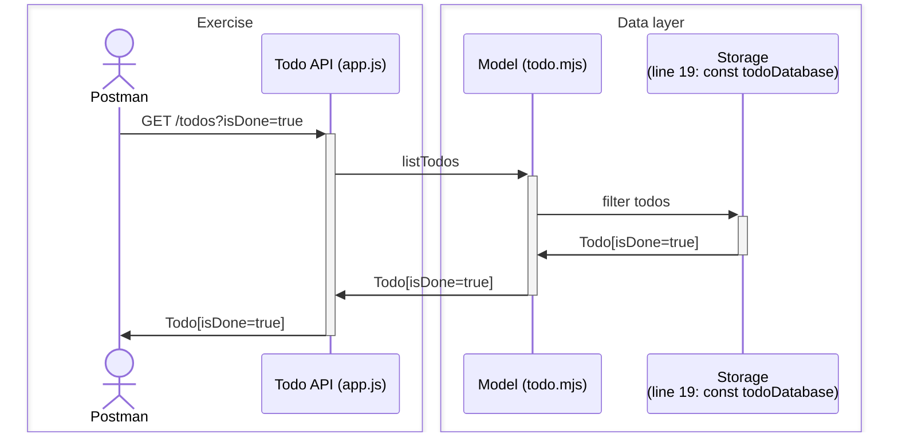

# Todo API: Filter

## Overview

Understand how to use request query to filter data from database.



## Miscellanenous

### JavaScript function

In JavaScript, functions are considered "first-class citizens". This means they
can be assigned to variables, stored in data structures, passed as arguments to
other functions, and returned as values from other functions.

This feature allows for powerful programming techniques like higher-order
functions and closures. For example, a function can be assigned to a variable
like this:

```js
const greet = function() { console.log('Hello!') }
```

And a function can be passed as an argument to another function like this:

```js
function callFunction(func) { func() }
callFunction(greet);
// "Hello!"
```

where `callFunction` is a higher-order function that accepts another function as
an argument.

### Higher-order function

In Node.js, a higher-order function is a function that can take other functions as arguments, or return a function as a result. This is possible because, in JavaScript, functions are "first-class citizens", meaning they can be treated like any other variable.

For example, the map function is a common higher-order function. It takes an array and a function as arguments, and applies the function to each element of the array:

```js
const numbers = [1, 2, 3];
const doubled = numbers.map(function(num) { return num * 2; });
console.log(doubled); // [2, 4, 6]
```

In this case, the function `function(num) { return num * 2; }` is passed to map as an argument.

Higher-order functions are a key part of functional programming, and they can make your code more concise and easier to understand.
