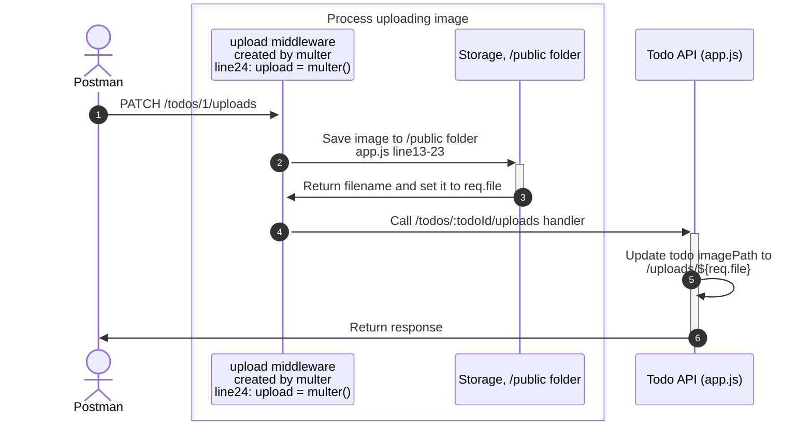

# Todo API: Upload Image 🖼️

## Overview

In this exercise, we will add the ability to upload images to our Todo API.



## Miscellanous

### Express request handlers

Express request handlers are functions that have the following signature:

```js
function (req, res, next) {
  // ...
}
```

A route handler can be a single function, or an array of functions. If it is an array of functions, each function in the array is called in order. 

```js
app.get('/todos', [
  (req, res, next) => {/** handler 1 */},
  (req, res, next) => {/** handler 2 */},
])
```

### Multi-part Form Data

Multi-part form data is a method of encoding data that is sent from a client to a server. It is often used when you need to send binary data, like the contents of a file, along with form data. This is the standard way to upload files to a server.

In a multi-part form data request, the HTTP payload is divided into multiple parts, each with its own content type and data. Each part is separated by a unique boundary string. This allows different types of data to be sent in a single HTTP request.

More information: https://developer.mozilla.org/en-US/docs/Web/API/XMLHttpRequest_API/Using_FormData_Objects

### Arrow functions

Arrow functions are a shorthand way of writing functions in JavaScript. They are often used as callback functions.

```js
// normal function
function (req, res, next) {
  // ...
}

// arrow function
(req, res, next) => {
  // ...
}
```

One of the main different between arrow functions and normal functions is that arrow functions do not have their own `this` value.

More information: https://developer.mozilla.org/en-US/docs/Web/JavaScript/Reference/Functions/Arrow_functions
