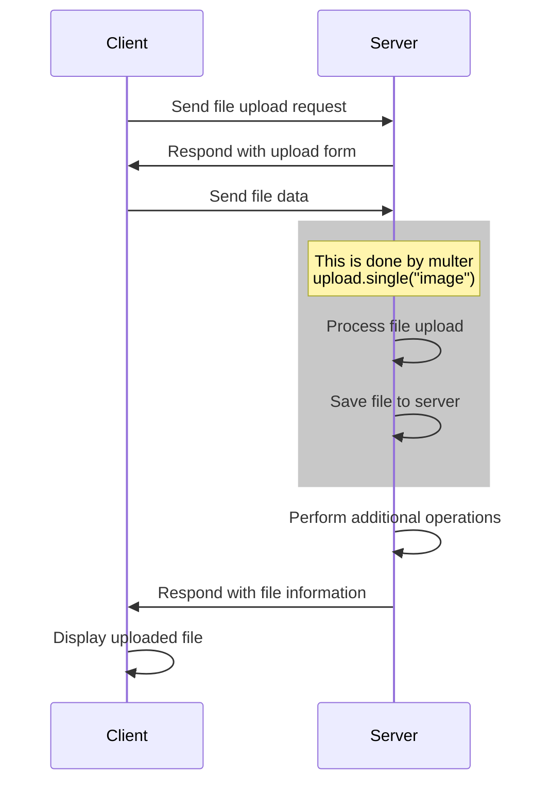

# Todo Upload Images

## Objective:

Understand how to use multer to upload images

### File upload

Web server file upload allows users to send files from their local machine to a
web server. This is commonly used for functionalities like uploading profile
pictures, attaching files to emails, or submitting documents.

Here's a step-by-step explanation of how web server file upload works:



## Exercise:

1. Update Postman to have "Upload Todo Image" API
2. Modify code in route `/todos/:todoId/uploads`
3. Update todo imagePath

Request:

```
POST /todos/3/uploads
```

Request Body (use Postman Body > form-data > change key value to "File"):


Response

```json
{
  "data": {
    "id": 3,
    "imagePath": "/uploads/5d5bed77-4126-4438-b57c-9b5961446f18.jpeg",
  }
}
```

## Documentation:

- https://expressjs.com/en/resources/middleware/multer.html
- https://www.npmjs.com/package/uuid
